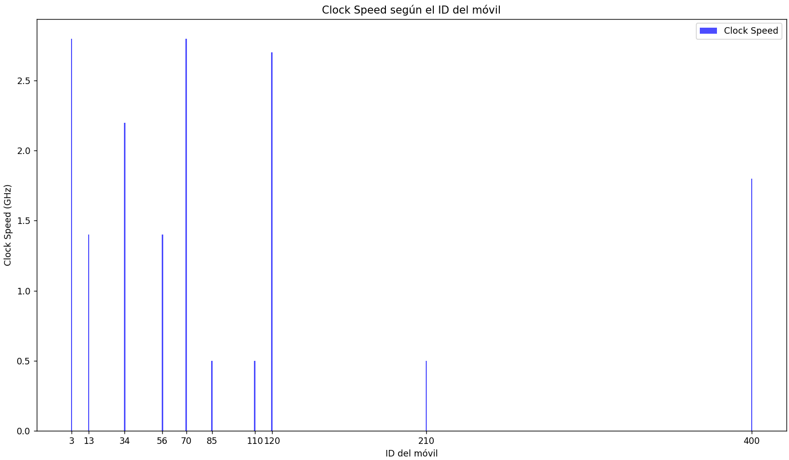

# ACTIVITAT 5 - PANDAS + MATPLOTLIB - EnricUlloaFlores

### EXERCICI A

Gràfiques de l'exercici A:

Execució del codi:

 

Gràfica 1A - Casos per mes per país:

 

Gràfica 2A - Morts per mes per país:

 

Gràfica 3A - Taxa de reproducció per mes per país:

 

### EXERCICI B

Gràfiques de l'exercici B:

Execució del codi:

 

Gràfica 1B - Població total per ciutat:

 

Gràfica 2B - Densitat per km2 per ciutat:

 

Gràfica 3B - Densitat per m2 per ciutat:

 

### EXERCICI C

Gràfiques de l'exercici C:

Execució del codi:

 

Gràfica 1C - Clock Speed segons la ID del mòbil:

 

Gràfica 2C - Megapixels segons la ID del mòbil:

 

Gràfica 3C - Battery Power segons la ID del mòbil:

 