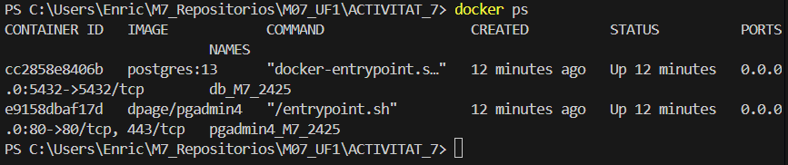
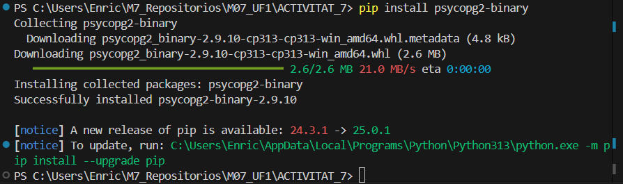
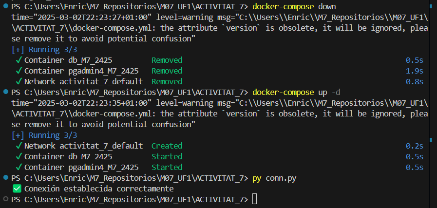
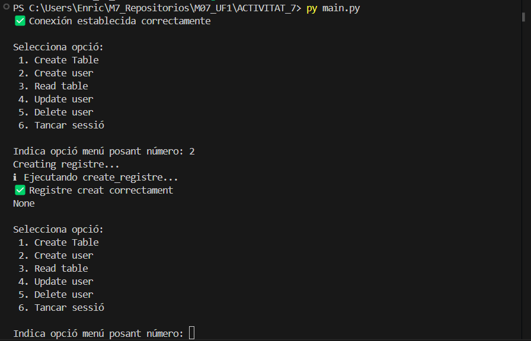
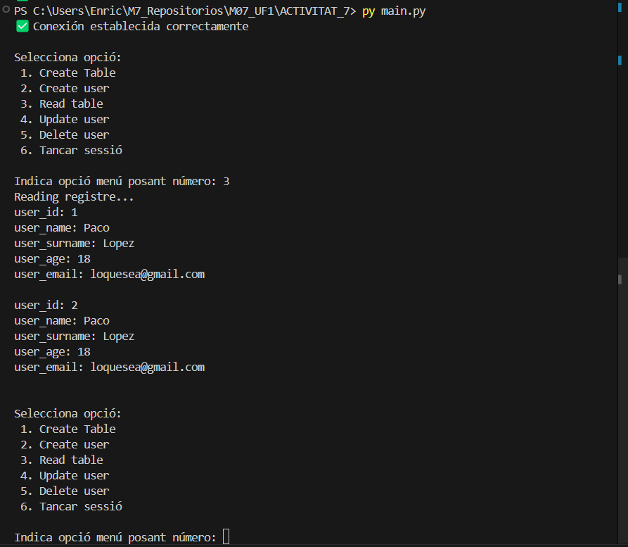
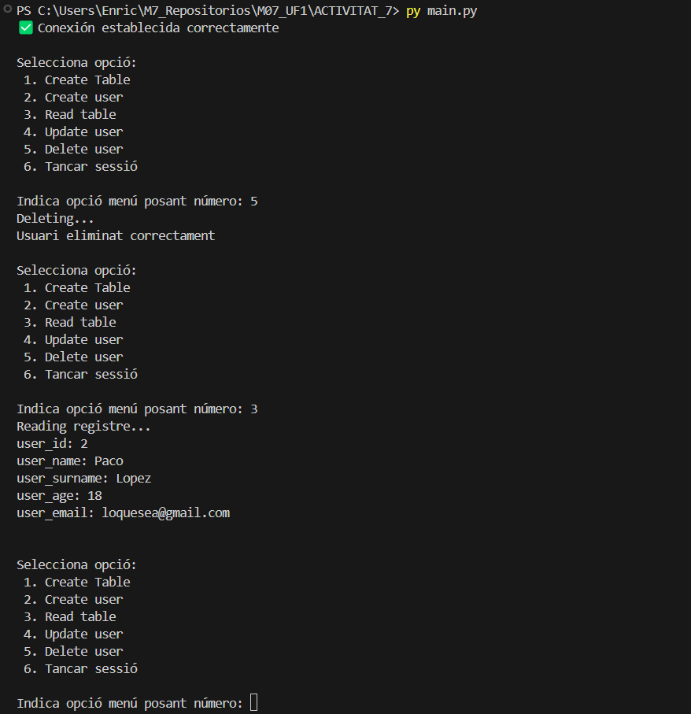
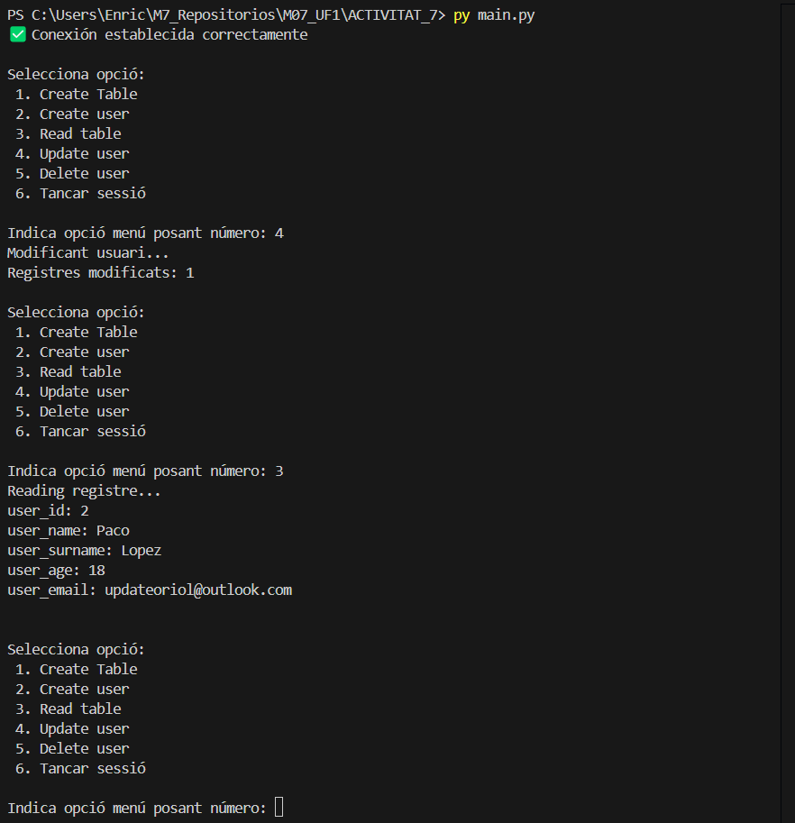

# ACTIVITAT 7 - PYTHON + POSTGRESQL

### Creacion:

 

### Comprovacion:

 

### Instalacion:

 

### Conexion establecida:

 

### Creacion de la tabla:

 

### CRUD

Creacion de registros correctamente:

 

Guardado en la base de datos:

 

Eliminacion de un usuario:

 

Update:

 
